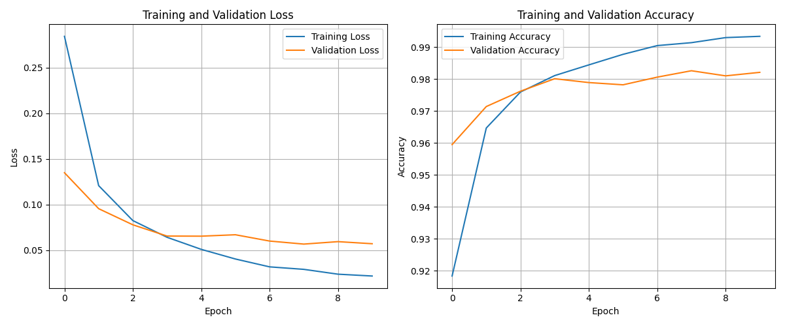

# Handwritten Digit Classification with Keras and MNIST

This project implements a deep learning model using **Keras** (with TensorFlow backend) to classify handwritten digits from the **MNIST dataset**. The model is trained, evaluated, and saved for future inference. All steps — from data preprocessing to visualization of training metrics — are included.

---

## 📌 Overview

- **Dataset**: [MNIST](https://www.tensorflow.org/datasets/catalog/mnist) – 60,000 training and 10,000 test images of handwritten digits (28x28 grayscale pixels).
- **Task**: Multiclass image classification (digits 0–9).
- **Framework**: TensorFlow 2.x with Keras.
- **Features**:
  - Data normalization and efficient input pipeline using `tf.data`.
  - Deep neural network with dropout for regularization.
  - Training with Adam optimizer and evaluation on test set.
  - Model saving in Keras format.
  - Training visualization (loss & accuracy curves).
  - Integration with TensorBoard for monitoring.

---

## 🏗️ Model Architecture

A simple feedforward neural network (Multilayer Perceptron) built using `tf.keras.Sequential`:

```python
model = tf.keras.Sequential([
    tf.keras.layers.Flatten(input_shape=(28, 28)),
    tf.keras.layers.Dense(512, activation='relu'),
    tf.keras.layers.Dropout(0.2),
    tf.keras.layers.Dense(10)
])
```


## ⚙️ Training Pipeline

The data pipeline uses `tensorflow_datasets` and `tf.data` for efficient loading and preprocessing:

- **Normalization**: Images converted from `uint8` to `float32` and scaled to [0, 1].
- **Batching**: 128 samples per batch.
- **Caching & Prefetching**: Improves training speed.
- **Shuffling**: Applied only on the training set.

---

## 🧪 Training & Evaluation

- **Optimizer**: Adam (`learning_rate=0.001` by default).
- **Loss**: `SparseCategoricalCrossentropy(from_logits=True)`.
- **Metrics**: Sparse Categorical Accuracy.
- **Epochs**: 10.
- **Validation**: Performance monitored on the test set.

After training, the model is evaluated on the test dataset to report final accuracy.

---

## 💾 Model Saving

The trained model is saved in the native Keras format (`.keras`) for persistence and future inference:

```bash
./deep_learning/classificatore_cifre/model_saved.keras
```

This format preserves the architecture, weights, and training configuration.

---

## 📈 Training Visualization

Two plots are generated at the end of training:

1. **Training vs Validation Loss**
2. **Training vs Validation Accuracy**

These help assess convergence and overfitting.

Additionally, the model architecture is visualized and saved as:

```bash
./deep_learning/classificatore_cifre/model.png
```

Using `keras.utils.plot_model` with shapes and layer names.

---

## 📊 TensorBoard Logging

Training logs are saved to:

```bash
./deep_learning/classificatore_cifre/logs
```

You can launch TensorBoard with:

```bash
tensorboard --logdir=./deep_learning/classificatore_cifre/logs
```

---

## 🖼️ Example Output

  


---

## ✅ Requirements

To run this project, install the required packages:

```bash
pip install tensorflow tensorflow-datasets matplotlib
```

---

## 🚀 How to Run

1. Clone the repository.
2. Run the script in a Python environment (e.g., Jupyter Notebook or `.py` file).
3. View results and plots.
4. (Optional) Launch TensorBoard to monitor training.

---

## 📁 Project Structure

```
deep_learning/
└── classificatore_cifre/
    ├── model_saved.keras      # Saved trained model
    ├── model.png              # Model architecture diagram
    ├── logs/                  # TensorBoard logs
    └── training_plots.png     # Accuracy and loss curves
```

---

## 📚 Resources

- [TensorFlow Keras Tutorial](https://www.tensorflow.org/tutorials/quickstart/beginner)
- [MNIST Dataset on TensorFlow Datasets](https://www.tensorflow.org/datasets/catalog/mnist)
- [Keras Sequential Model](https://keras.io/guides/sequential_model/)

---
